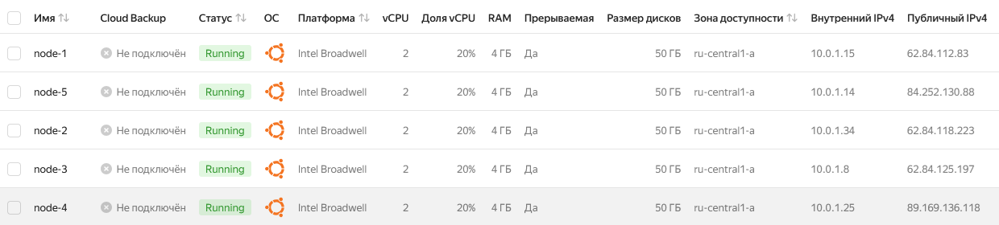
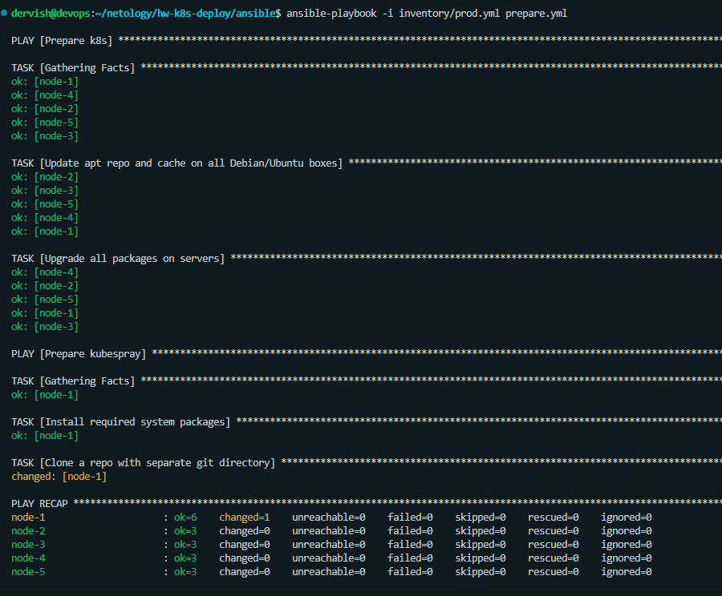
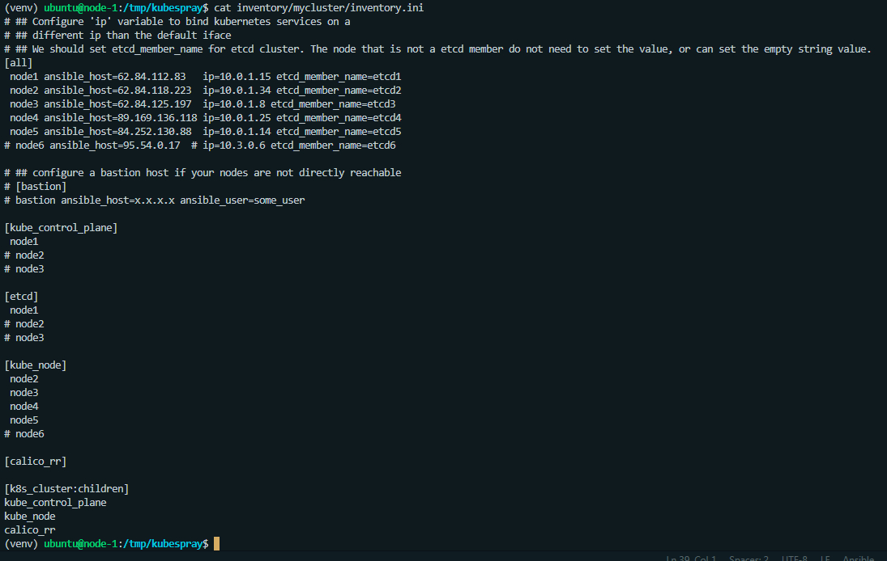
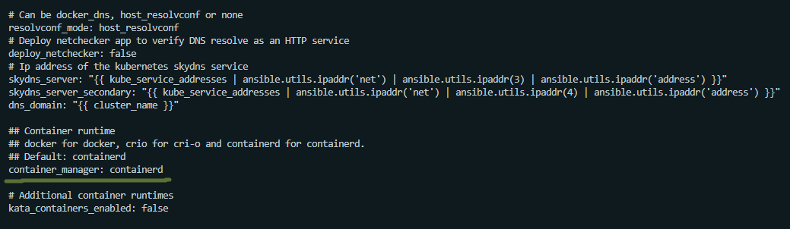
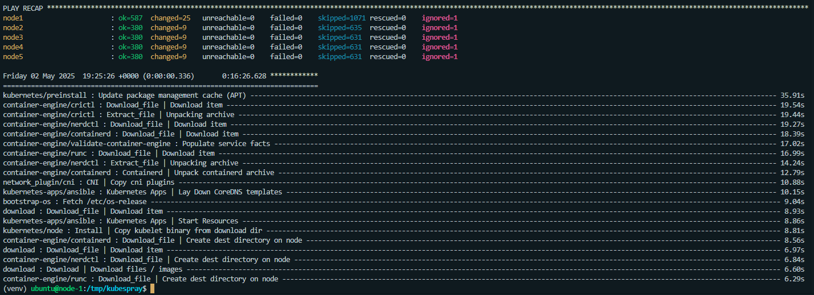
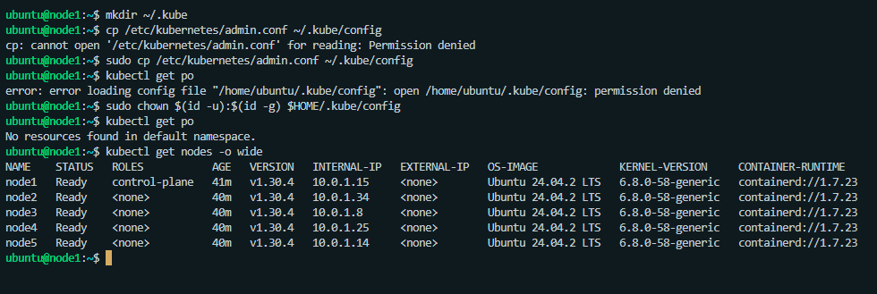

# Домашнее задание к занятию «Установка Kubernetes»

## Цель задания

Установить кластер K8s.

## Чеклист готовности к домашнему заданию

1. Развёрнутые ВМ с ОС Ubuntu 24.04-lts.

>Необходимые для работы ВМ разворачиваем в Яндекс Облаке при помощи скриптов [terraform](./terraform/src)

>Для установки обновлений пакетов и скачивания репозитория kubespray на мастер-ноду используем плейбук [prepare.yml](./ansible/prepare.yml)
>Прокидываем в мастер-ноду ssh ключ - это нужно для корректной работы скриптов установки ansible.
>scp /home/dervish/.ssh/id_ed25519 ubuntu@62.84.112.83:.ssh/id_ed25519

>На мастер-ноде в папке со скачаным ранее репозиторием kubespray создаем и активируем виртуальное окружение
>python3 -m venv venv
>source venv/bin/activate

>Устанавливаем зависимости
>python3 -m pip install -r requirements.txt

>Запустим еще несколько подготовительных команд
>cp -rfp inventory/sample inventory/mycluster
>declare -a IPS=(10.0.1.15 10.0.1.34 10.0.1.8 10.0.1.25 10.0.1.14)
>CONFIG_FILE=inventory/mycluster/hosts.yaml
>python3 contrib/inventory_builder/inventory.py ${IPS[@]}

## Задание 1. Установить кластер k8s с 1 master node

1. Подготовка работы кластера из 5 нод: 1 мастер и 4 рабочие ноды.

>Необходимые настройки делаем в файле inventory/mycluster/inventory.ini

2. В качестве CRI — containerd.

>Эта настройка выбирается в файле inventory/mycluster/group_vars/k8s_cluster/k8s-cluster.yml

3. Запуск etcd производить на мастере.

>Необходимые настройки делаем в файле inventory/mycluster/inventory.ini

4. Способ установки выбрать самостоятельно.

>Устанавливать кластер будем при помощи kubespray
>ansible-playbook -i inventory/mycluster/inventory.ini playbooks/cluster.yml -b -v &

>Проверка установки

